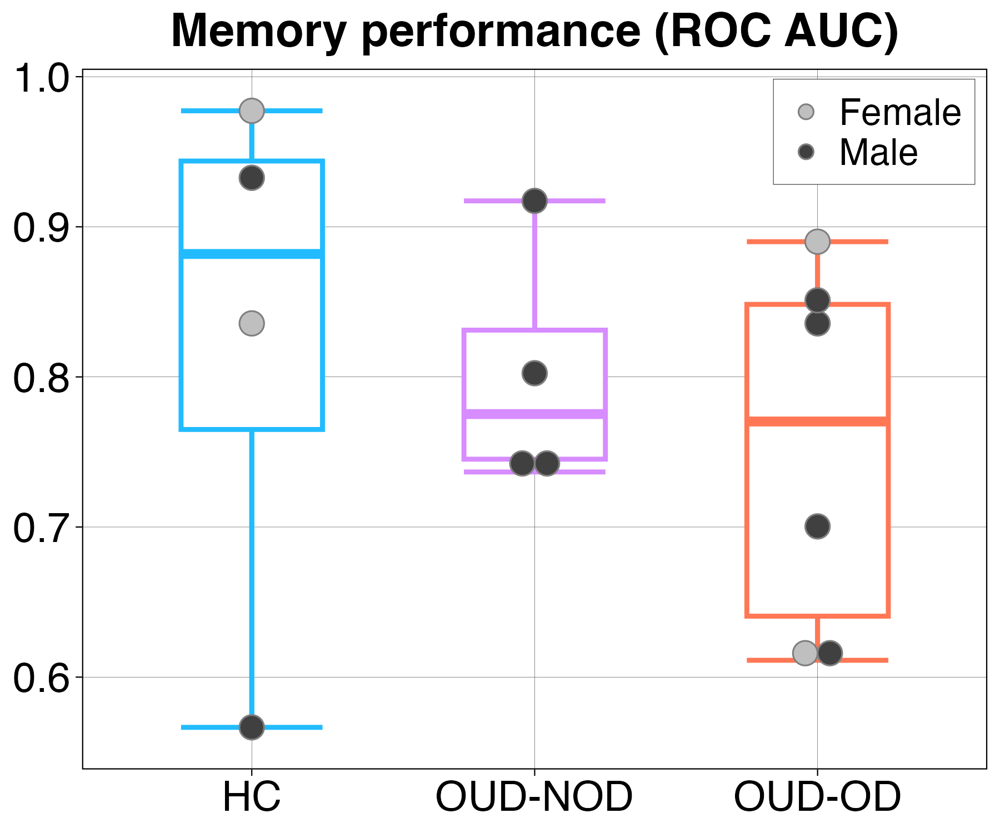

**Episodic Memory**

**Research Question**

Does opioid use disorder (OUD) and a history of non-fatal overdose affect episodic memory performance or hippocampal neural activity during memory encoding?

**Participants**

Participants were drawn from the structural and functional MRI cohort and included:

* Healthy controls (HC): n = 4
* OUD without non-fatal overdose (OUD-NOD): n = 4
* OUD with non-fatal overdose (OUD-OD): n = 6

**Imaging**

Structural MRI data were acquired using T1-weighted MPRAGE sequences on 3T Siemens MRI scanners. Functional MRI data were acquired on a 3T Siemens Prisma using a T2*-weighted BOLD EPI sequence during an episodic memory encoding task.

**Task and Analysis**

**Episodic Memory Performance**

Participants completed an episodic memory task consisting of an encoding phase during fMRI and a retrieval phase approximately 30 minutes later.

During encoding, participants made semantic judgments about 176 objects. During retrieval, participants identified previously presented ("old") and novel ("new") objects using a five-point confidence scale.

Memory performance was quantified using the area under the receiver operating characteristic curve (ROC AUC), calculated from true- and false-positive rates across response thresholds.

Statistical analyses were conducted in R (v4.2.2). One-way ANOVAs were used to examine group differences in episodic memory performance.

**Results**

Episodic memory performance, measured by ROC AUC, did not significantly differ across groups (*F*(2,11) = 0.40, *p* = 0.68, η² = 0.07).

Mean ROC AUC was:

* HC: 0.83 [0.68, 0.98]
* OUD-NOD: 0.80 [0.65, 0.95]
* OUD-OD: 0.75 [0.63, 0.87]

Although the overall group effect was not significant, an exploratory post hoc comparison showed a medium effect size (Cohen's *d* = 0.56) for lower memory performance in the OUD-OD group compared with healthy controls.

**Figure 1.** Episodic memory performance, quantified using ROC AUC, across healthy controls, OUD-NOD, and OUD-OD groups.

**Code**

Analysis code used to calculate episodic memory performance, extract hippocampal task-related activity, and perform group-level statistical analyses is available in the `Code/` directory.

**Related Publication**

McKinstry D, et al. Hippocampal volume and brain tau pathology in opioid use disorder: associations with non-fatal opioid overdose. Addict Neurosci. 2026;19:100253. PMID: 41947888
