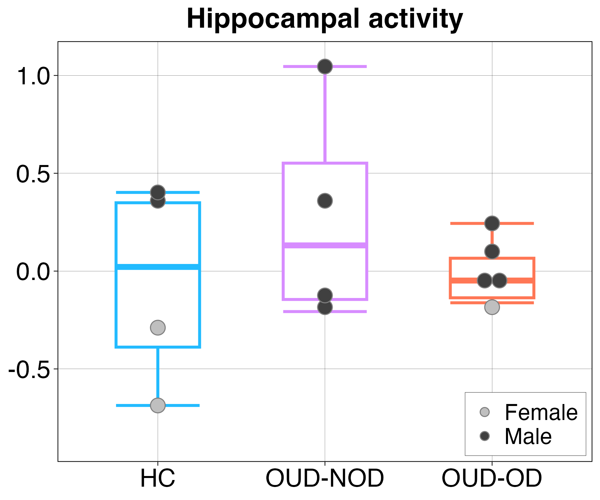

**Hippocampal Activity**

**Research Question**

Does opioid use disorder (OUD) and a history of non-fatal overdose affect hippocampal neural activity during successful episodic memory encoding?

**Participants**

Participants were drawn from the structural and functional MRI cohort and included:

* Healthy controls (HC): n = 4
* OUD without non-fatal overdose (OUD-NOD): n = 4
* OUD with non-fatal overdose (OUD-OD): n = 6

**Imaging**

Structural MRI data were acquired using T1-weighted MPRAGE sequences on 3T Siemens MRI scanners. Functional MRI data were acquired on a 3T Siemens Prisma using a T2*-weighted BOLD EPI sequence during an episodic memory encoding task.

Functional images were preprocessed using SPM12, including slice-time correction, motion correction, coregistration to structural MRI, normalization to MNI space, and spatial smoothing.

**Task and Analysis**

Participants completed an episodic memory task consisting of an encoding phase during fMRI and a retrieval phase approximately 30 minutes later.

During encoding, participants made semantic judgments about 176 objects. Subsequent memory performance during the retrieval phase was used to classify encoding trials as **remembered** or **forgotten**.

First-level general linear models included task conditions, motion parameters, and run-specific constants. Successful memory encoding was assessed using the **remembered > forgotten** contrast.

Hippocampal neural activity was quantified by extracting the resulting contrast value from the left and right hippocampus, defined using the Neuromorphometrics atlas.

Group-level analyses were conducted in R (v4.2.2). One-way ANOVAs were used to examine differences in hippocampal activity across HC, OUD-NOD, and OUD-OD groups.

**Results**

Hippocampal neural activity during successful memory encoding did not significantly differ across groups (*F*(2,11) = 0.90, *p* = 0.43, η² = 0.14).

Mean hippocampal remembered-versus-forgotten contrast values were:

* HC: −0.06 [−0.59, 0.47]
* OUD-NOD: 0.28 [−0.25, 0.80]
* OUD-OD: −0.13 [−0.56, 0.30]

Given the small sample size, these findings should be interpreted as exploratory.

**Figure 1.** Hippocampal neural activity associated with successful memory encoding (remembered > forgotten) across healthy controls, OUD-NOD, and OUD-OD groups.

**Code**

Analysis code for the group-level analysis of hippocampal task-related activity is available in the `Code/` directory.

**Related Publication**

McKinstry D, et al. Hippocampal volume and brain tau pathology in opioid use disorder: associations with non-fatal opioid overdose. *Addict Neurosci.* 2026;19:100253. PMID: 41947888.
