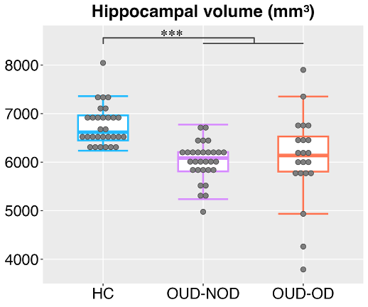

**Hippocampal Volume Analysis**

**Research Question**

Is hippocampal volume altered in individuals with opioid use disorder,
and does a history of non-fatal overdose relate to additional
hippocampal volume differences?

**Participants**

- Healthy controls (n = 30)
- OUD without overdose history (n = 30)
- OUD with overdose history (n = 21)

**Imaging**

Hippocampal volumes were derived from T1-weighted structural MRI scans using the Automatic Segmentation of Hippocampal Subfields (ASHS) pipeline (https://github.com/pyushkevich/ashs), implemented in ITK-SNAP. Segmentation followed established protocols for in vivo structural MRI data (Xie et al., 2019). Total intracranial volume (ICV) was estimated using ASHS-HarP 1.0.2 and used to account for differences in overall brain size.

**Analysis**

Hippocampal volume was compared across healthy controls (HC), individuals with opioid use disorder without a history of non-fatal overdose (OUD-NOD), and individuals with opioid use disorder and a history of non-fatal overdose (OUD-OD).

Group differences in hippocampal volume were assessed using analysis of covariance (ANCOVA), with age, sex, and total intracranial volume included as covariates. A separate model tested the interaction between sex and group. When a significant main effect of group was observed, planned pairwise comparisons were performed between HC and the combined OUD groups and between OUD-NOD and OUD-OD groups, with Sidak correction for multiple comparisons.

Statistical analyses were conducted in R (v4.2.2). Exploratory analyses examined left and right hippocampal volumes separately, as well as additional pairwise comparisons and effect sizes.

**Results**

Hippocampal volume differed significantly across groups (F(2,75) = 12.76, p < 0.001, partial η² = 0.25). Individuals with OUD had smaller hippocampal volumes than healthy controls (difference = 713 mm³, p < 0.001, Cohen’s d = 1.22), while hippocampal volume did not differ between individuals with OUD with and without a history of non-fatal overdose (p = 0.92).

A significant sex-by-group interaction was also observed (F(2,73) = 3.17, p = 0.048, partial η² = 0.08), with a larger OUD-related difference in hippocampal volume among women than men.

**Figure 1.** Hippocampal volume was significantly lower in individuals
with OUD compared with healthy controls, with no significant difference
between OUD-NOD and OUD-OD groups.

**Code**

The analysis code used to generate the statistical results and figure
is available in the `code/` directory.

**Related Publication**

McKinstry D, et al. Hippocampal volume and brain tau pathology in opioid use disorder: associations with non-fatal opioid overdose. Addict Neurosci. 2026;19:100253. PMID: 41947888

