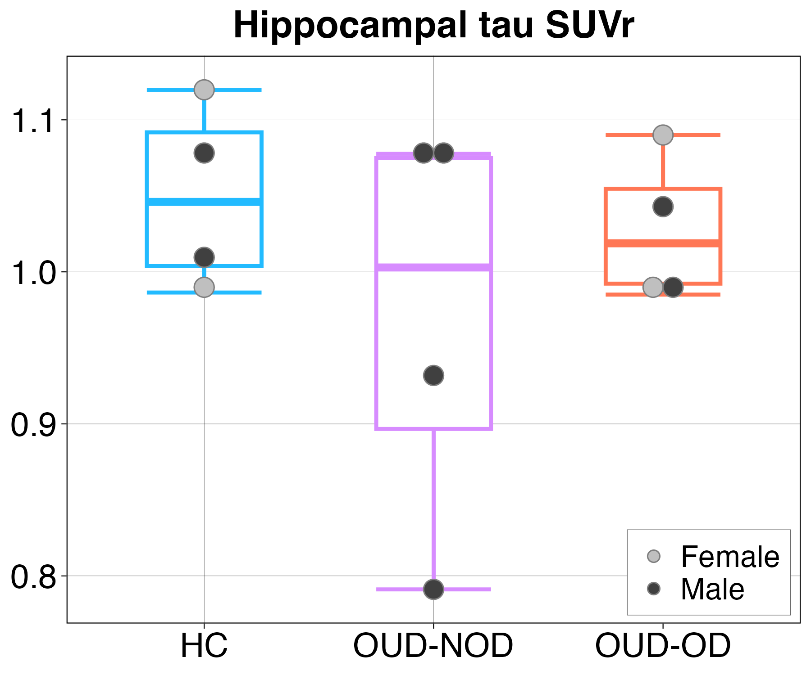

**Tau PET Analysis**

**Research Question**

Does tau deposition differ among healthy controls, individuals with opioid use disorder without a history of non-fatal overdose, and individuals with opioid use disorder and a history of non-fatal overdose?

**Participants**

PET data were available for a subset of participants from the larger structural MRI cohort:

* Healthy controls (HC): n = 4
* OUD without non-fatal overdose (OUD-NOD): n = 4
* OUD with non-fatal overdose (OUD-OD): n = 6

**Imaging**

Participants underwent [18F]PI-2620 tau PET imaging on the PennPET Explorer. A 30-minute PET/CT scan was acquired beginning approximately 45 minutes after intravenous tracer injection (mean dose = 5.44 ± 0.38 mCi).

**Analysis**

PET images were processed using PMOD (v4.2). PET images were aligned to each participant's T1-weighted structural MRI using Advanced Normalization Tools (ANTs). Standardized uptake value ratio (SUVr) maps were generated using cerebellar gray matter as the reference region.

Tau deposition was quantified within the hippocampus, cortical gray matter, and subcortical gray matter. Group differences in tau SUVr were evaluated using one-way ANOVAs.

**Results**

Hippocampal tau deposition did not significantly differ across groups (F(2,9) = 0.85, p = 0.46, η² = 0.16). Mean hippocampal tau SUVr was 1.05 in HC, 0.97 in OUD-NOD, and 1.03 in OUD-OD.

Similarly, no significant group differences were observed in cortical gray matter tau deposition (F(2,9) = 0.41, p = 0.68) or subcortical gray matter tau deposition (F(2,9) = 2.37, p = 0.15).

Given the small PET sample, these findings should be interpreted as exploratory.

**Figure 1.** Hippocampal tau SUVr did not significantly differ among
healthy controls, OUD-NOD, and OUD-OD groups.

**Code**

Analysis code used to generate the statistical results and figures is available in the `code/` directory.

**Related Publication**

McKinstry D, et al. Hippocampal volume and brain tau pathology in opioid use disorder: associations with non-fatal opioid overdose. Addict Neurosci. 2026;19:100253. PMID: 41947888

